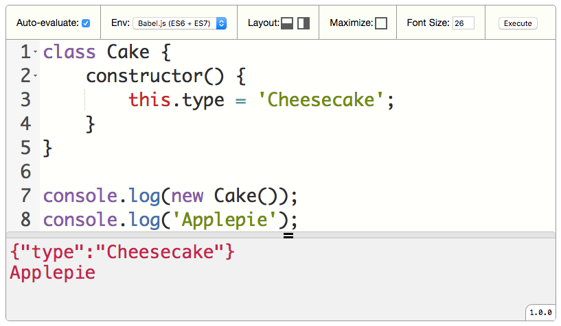

<p align="center">
    
</p>
<h3 align="center">executor-editor</h3>
<p align="center">:hammer: Display and evaluate your JavaScript code.</p>
<p align="center">
    <a href="https://badge.fury.io/js/executor-editor">
        
    </a>
    <a href="https://www.npmjs.com/~piecioshka">
        
    </a>
    <a href="https://github.com/piecioshka/executor-editor">
        
    </a>
    <a href="https://snyk.io/test/github/piecioshka/executor-editor?targetFile=package.json">
        
    </a>
</p>

## Demo 🎉

<https://piecioshka.github.io/executor-editor/demo/>

## Features

* :white_check_mark: Embed any programming code
* :white_check_mark: Highlight JavaScript syntax
* :white_check_mark: Auto-evaluate the JavaScript code
* :white_check_mark: Execute code on demand
* :white_check_mark: Layout modes: `horizontal`, `vertical`
* :white_check_mark: Multiple instance on single page
* :white_check_mark: Support skins
* :white_check_mark: Display errors in red color

## Installation

```bash
npm install executor-editor
```

or

```bash
bower install executor-editor
```

## Usage

1. Add CSS class `executor-editor` to HTML element:

    ```html
    <pre class="executor-editor">
    class Cake {
        toString() {
            return '[Cake]';
        }
    }

    console.log(String(new Cake()));
    </pre>
    ```

2. Add on the bottom of page, example before `</body>`

    ```html
    <link href="/path/to/executor-editor/dist/executor-editor.css"/>
    <link href="/path/to/executor-editor/dist/skins/blue-skin.css"/>
    <link href="/path/to/executor-editor/dist/skins/normal-skin.css"/>

    <script src="/path/to/executor-editor/dist/executor-editor.js"></script>
    <script>ExecutorEditor.setup();</script>
    ```

## API

All settings you can pass by HTML attributes.

### `data-autoevaluate`

* Default: `true`
* Options: `true` | `false`
* Example:

    ```html
    <pre class="executor-editor" data-autoevaluate="false">
        [...]
    </pre>
    ```

### `data-autofocus`

* Default: `true`
* Options: `true` | `false`
* Example:

    ```html
    <pre class="executor-editor" data-autofocus="true">
        [...]
    </pre>
    ```

### `data-skin`

* Default: `normal`
* Options: `normal` | `blue`
* Example:

    ```html
    <pre class="executor-editor" data-skin="blue">
        [...]
    </pre>
    ```

## Purpose

Project was made to embed code on presentation slides.

## License

[The MIT License](https://piecioshka.mit-license.org) @ 2015-2019
