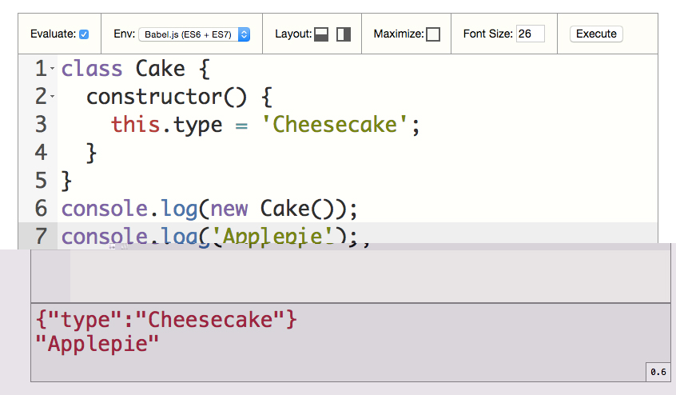

# executor

> Display and evaluate your JavaScript code.



## How to use?

1. Add to `<head>`:

    ```html
    <script src="dist/executor.min.js"></script>
    ```

2. Add CSS class `executor-code` to HTML element:

    ```html
    <pre class="executor-code">
    class Cake {
        constructor() {
            this.type = 'Cheesecake';
        }
    }
    console.log(new Cake());
    console.log('Applepie');
    </pre>
    ```

## API

All settings you can pass by HTML attributes.

### data-font-size

Optional. *Default: 16*<br />
Change size of font of code and in result container.<br />
Example:

```html
<div class="executor-code" data-font-size="26">
```

### data-timeout

Optional. *Default: 1000*<br />
Number of **milliseconds** of delay between last keydown and evaluate code.<br />
Example:

```html
<div class="executor-code" data-timeout="500">
```

## Purpose

 - presentation slides
 - application which evaluate code in ECMAScript 6 or 7

## Features

 - embed any programming code
 - highlight JavaScript syntax
 - auto-evaluate the JavaScript code
 - change environment, modes: `browser`, `Babel.js`
 - change layout, modes: `horizontal`, `vertical`
 - maximize window with code - containers: `tools` and `result` are hide
 - change font size, limits: `10` - `99`
 - execute code on demand
 - multiple instance on single page

## Build own version

Before execute this code check that you have installed globally `npm`, `bower` and `webpack`.

```
git clone git@github.com:piecioshka/executor.git
cd executor
```

Install by run single command:

```
make
```

or

```
npm install     # install Babel.js
bower install   # install Ace.js (Builds)
webpack         # build `dist/executor.js`
```

Open in browser `demo/index.html`.

## Contact

Catch me on @[piecioshka](http://twitter.com/piecioshka).

## License

[The MIT License](http://piecioshka.mit-license.org)
