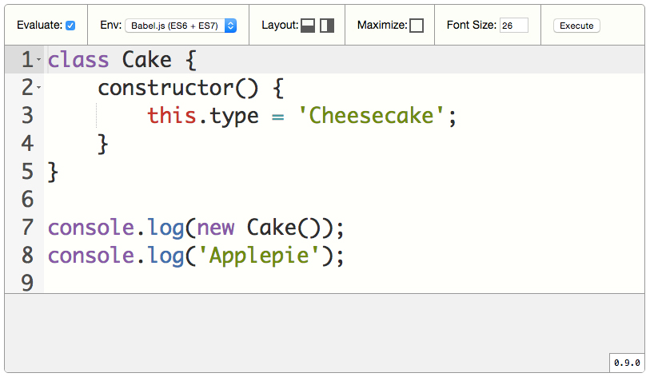

# executor


> Display and evaluate your JavaScript code.



## Demo

:zap: Please enter to: http://piecioshka.github.io/executor/demo/

## Install

* By Bower command: `bower install executor`
* By npm command: `npm install executor-editor`
* Grap from http://piecioshka.github.io/executor/dist/executor.js
* Build own version by `make` command

## Usage

1. Add CSS class `executor-code` to HTML element:

    ```html
    <pre class="executor-code">
    class Cake {
        constructor() {
            this.type = 'Cheesecake';
        }
    }
    console.log(new Cake());
    console.log('Applepie');
    </pre>
    ```

2. Add on the bottom of page, example before `</body>`

    ```html
    <script src="dist/executor.min.js"></script>
    <script>Executor.setup();</script>
    ```

## API

All settings you can pass by HTML attributes.

### data-font-size

Optional. *Default: 16*<br />
Change size of font of code and in result container.<br />
Example:

```html
<div class="executor-code" data-font-size="26">
```

### data-auto-exec-delay

Optional. *Default: 1000*<br />
Number of **milliseconds** of delay between last keydown and evaluate code.<br />
Example:

```html
<div class="executor-code" data-auto-exec-delay="500">
```

### data-width

Optional. *Default: 800*<br />
Width of editor<br />
Example:

```html
<div class="executor-code" data-width="1000">
```

### data-height

Optional. *Default: 460*<br />
Height of editor<br />
Example:

```html
<div class="executor-code" data-height="800">
```

## Purpose

* presentation slides
* application which evaluate code in ECMAScript 6 or 7

## Features

* use Ace (https://ace.c9.io/#nav=howto) editor
* embed any programming code
* highlight JavaScript syntax
* auto-evaluate the JavaScript code
* change environment, modes: `browser`, `Babel.js`
* change layout, modes: `horizontal`, `vertical`
* maximize window with code - containers: `tools` and `result` are hide
* change font size, limits: `10` - `99`
* execute code on demand
* multiple instance on single page

## Build own version

Before execute this code check that you have installed globally `npm`, `bower` and `webpack`.

```
git clone git@github.com:piecioshka/executor.git
cd executor
```

Install by run single command:

```
make
```

or

```
npm install
bower install
npm run build
```

## Contact

Catch me on Twitter: @[piecioshka](http://twitter.com/piecioshka).

## License

[The MIT License](http://piecioshka.mit-license.org) @ 2015
