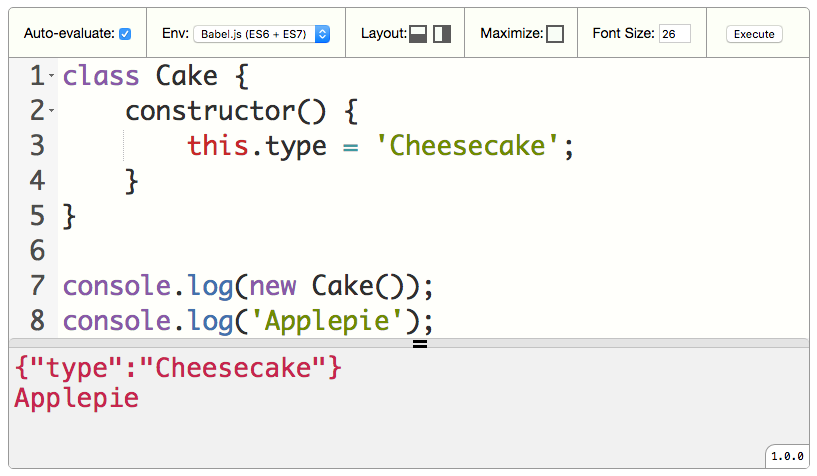

# executor-editor

[](https://www.npmjs.com/package/executor-editor)
[](https://badge.fury.io/js/executor-editor)
[](https://www.npmjs.com/package/executor-editor)
[](https://packagephobia.com/result?p=executor-editor)
[](https://piecioshka.mit-license.org)
[](https://github.com/piecioshka/executor-editor/actions/workflows/testing.yml)

🔨 Display and evaluate your JavaScript code.

## Preview 🎉

<https://piecioshka.github.io/executor-editor/demo/>



## Features

- ✅ Embed any programming code
- ✅ Highlight JavaScript syntax
- ✅ Auto-evaluate the JavaScript code
- ✅ Execute code on demand
- ✅ Layout modes: `horizontal`, `vertical`
- ✅ Maximize mode: show the code only
- ✅ Multiple instance on single page
- ✅ Support skins
- ✅ Display errors in red color
- ✅ Written in TypeScript

## Usage

Installation:

```bash
npm install executor-editor
```

or

```bash
bower install executor-editor
```

1. Add CSS class `executor-editor` to HTML element:

    ```html
    <pre class="executor-editor">
    class Cake {
        toString() {
            return '[Cake]';
        }
    }

    console.log(String(new Cake()));
    </pre>
    ```

2. Add on the bottom of page, example before `</body>`

    ```html
    <link href="/path/to/executor-editor/dist/executor-editor.css"/>
    <link href="/path/to/executor-editor/dist/skins/blue-skin.css"/>
    <link href="/path/to/executor-editor/dist/skins/normal-skin.css"/>

    <script src="/path/to/executor-editor/dist/executor-editor.js"></script>
    <script>ExecutorEditor.setup();</script>
    ```

## API

All settings you can pass by HTML attributes.

### `data-autoevaluate`

* Default: `true`
* Options: `true` | `false`
* Example:

    ```html
    <pre class="executor-editor" data-autoevaluate="false">
        [...]
    </pre>
    ```

### `data-autofocus`

* Default: `true`
* Options: `true` | `false`
* Example:

    ```html
    <pre class="executor-editor" data-autofocus="true">
        [...]
    </pre>
    ```

### `data-skin`

* Default: `normal`
* Options: `normal` | `blue`
* Example:

    ```html
    <pre class="executor-editor" data-skin="blue">
        [...]
    </pre>
    ```

### `data-layout`

* Default: `horizontal`
* Options: `horizontal` | `vertical`
* `horizontal` places the editor next to the result; `vertical` stacks the editor above the result.
* Example:

    ```html
    <pre class="executor-editor" data-layout="vertical">
        [...]
    </pre>
    ```

### `data-maximize`

* Default: `false`
* Options: `true` | `false`
* When `true`, the editor starts maximized: the result panel is hidden and the editor fills the component, useful to present code without running it. Toggle it at runtime with the `Maximize` button.
* Example:

    ```html
    <pre class="executor-editor" data-maximize="true">
        [...]
    </pre>
    ```

## Testing

End-to-end tests run in a real browser with [Playwright](https://playwright.dev/).

```bash
npm run build
npx playwright install chromium
npm run e2e
```

`npm run e2e` builds the bundle, serves it and drives `e2e/fixtures/index.html`
in a headless browser. The tests cover initialization, the `data-*` options,
the toolbar interactions and code execution.

The sources are written in TypeScript. Run `npm run typecheck` to type-check
without emitting and `npm run build` to bundle with `ts-loader`.

## Purpose

The project was created for presentation slides, to embed code and quickly execute it.

## License

[The MIT License](https://piecioshka.mit-license.org) @ 2015
